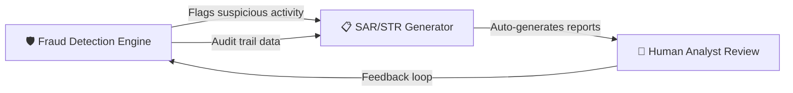
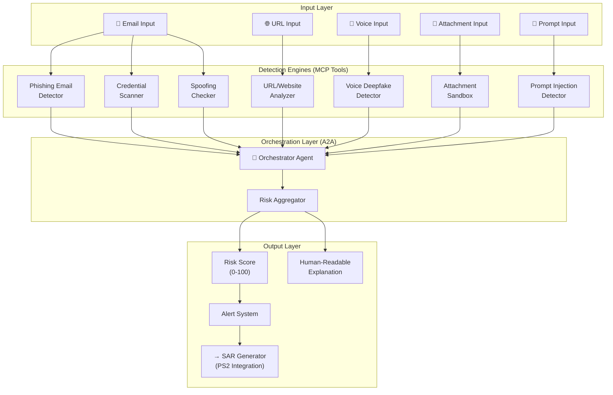
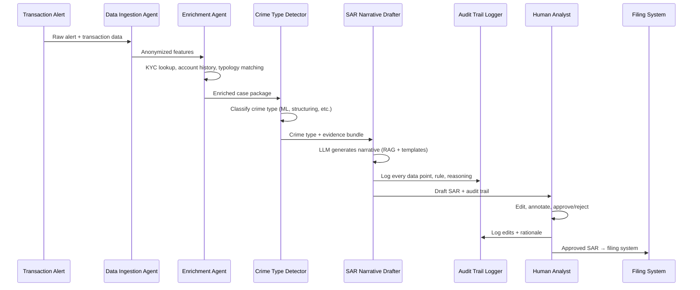
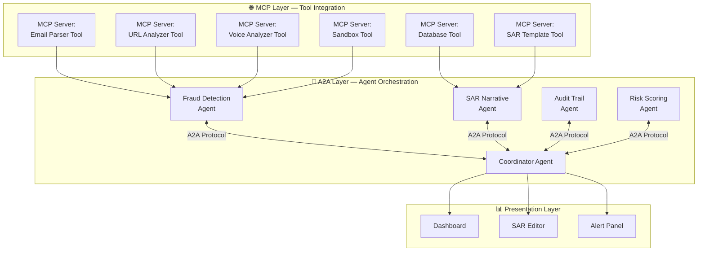

# 🔍 Comprehensive Analysis: AI-Powered Banking Fraud & Compliance Platform

> Two problem statements, one unified vision — a modular, privacy-first platform for detecting GenAI fraud and automating regulatory compliance.

---

## Table of Contents

1. [Executive Summary](#executive-summary)
2. [Problem Statement 1: Detecting AI-Generated Fraud Content](#ps1)
3. [Problem Statement 2: SAR Narrative Generator with Audit Trail](#ps2)
4. [Competitive Analysis](#competitive-analysis)
5. [Unified Architecture with MCP / A2A](#unified-architecture)
6. [Hot Topic Integration: MCP, A2A, AP2](#hot-topics)
7. [Additional Fraud Detection Capabilities](#additional-fraud)
8. [Feasibility Assessment](#feasibility)
9. [Prototype Implementation Steps](#prototype-steps)
10. [How to Compile Everything for Presentation](#presentation-guide)
11. [Key Statistics & Data Points (India-Specific)](#stats)

---

## 1. Executive Summary {#executive-summary}

Both problem statements are **highly complementary** and can be packaged as a **single unified platform** — think of it as **"FraudShield AI"** (or any name you choose). The pitch:

> _"An end-to-end, privacy-first AI platform that detects GenAI-generated fraud (phishing, deepfakes, spoofing, prompt injection) AND automates SAR/STR narrative generation with full audit trails — powered by locally-hosted LLMs, MCP protocol for tool integration, and A2A protocol for multi-agent orchestration."_

### Why These Two Fit Together



- **PS1 (Fraud Detection)** catches the threats → feeds alerts to → **PS2 (SAR Generator)** which auto-drafts regulatory reports
- Both share the same data privacy constraints (offline LLMs, no external data transmission)
- Both benefit from MCP (tool integration) and A2A (multi-agent coordination)

---

## 2. Problem Statement 1: Detecting AI-Generated Fraud Content {#ps1}

### 2.1 Problem Decomposition

| Fraud Vector                           | Detection Approach                                   | Difficulty  | Priority    |
| -------------------------------------- | ---------------------------------------------------- | ----------- | ----------- |
| **AI-generated phishing emails**       | LLM-based text classification + stylometric analysis | Medium      | 🔴 Critical |
| **Credential exposure detection**      | Regex + entropy analysis + secret scanning           | Low-Medium  | 🔴 Critical |
| **Attachment verification (Pharming)** | Sandbox execution + hash matching + file analysis    | Medium-High | 🟡 High     |
| **Website phishing testing**           | URL analysis + DOM comparison + SSL cert validation  | Medium      | 🟡 High     |
| **Cookie manipulation detection**      | HTTP header analysis + cookie integrity checks       | Medium      | 🟢 Medium   |
| **Deepfake voice scams**               | MFCC + spectrogram analysis + CNN/RNN classifiers    | High        | 🟡 High     |
| **Prompt injection / jailbreaking**    | Input sanitization + canary tokens + LLM guardrails  | High        | 🟡 High     |
| **Data poisoning detection**           | Statistical analysis + drift detection               | Very High   | 🟢 Medium   |
| **Agentic AI sandbox testing**         | Isolated execution environment + behavior monitoring | High        | 🟢 Medium   |
| **All types of spoofing**              | Multi-signal verification (SPF/DKIM/DMARC, ARP, DNS) | Medium      | 🟡 High     |

### 2.2 Recommended Tech Stack

| Layer                     | Technology                                                                | Why                                                    |
| ------------------------- | ------------------------------------------------------------------------- | ------------------------------------------------------ |
| **LLM (local)**           | Ollama + Llama 3.1 8B / Mistral 7B                                        | Runs fully offline, no data leaves the environment     |
| **AI-text detection**     | Fine-tuned DeBERTa / RoBERTa on Hugging Face                              | State-of-art classifier for AI-generated text          |
| **Voice deepfake**        | Librosa (MFCC extraction) + PyTorch CNN                                   | MFCC-based approach as specified, proven 95%+ accuracy |
| **Email parsing**         | `email` stdlib + SpamAssassin headers                                     | Parse EML/MSG, extract headers, body, attachments      |
| **Phishing URL analysis** | `tldextract`, `whois`, `requests`, Google Safe Browsing API (local cache) | Multi-signal URL scoring                               |
| **Sandbox**               | Docker/Firecracker micro-VMs or Bubblewrap                                | Isolated execution for attachment & agent testing      |
| **Secret scanning**       | `detect-secrets` (Yelp), regex patterns                                   | Credential exposure detection                          |
| **Spoofing checks**       | `checkdmarc`, `dnspython`, Scapy                                          | SPF/DKIM/DMARC + ARP/DNS spoofing detection            |
| **Framework**             | FastAPI + Celery (async tasks)                                            | High-performance API with background processing        |
| **Frontend**              | Streamlit / Gradio (demo) or React (production)                           | Interactive dashboard                                  |
| **Vector DB**             | ChromaDB                                                                  | Local, lightweight, embeds threat signatures           |
| **Database**              | SQLite / PostgreSQL                                                       | Alert and audit log storage                            |

### 2.3 Data Sources

| Dataset                       | Source                                      | Use                                                  |
| ----------------------------- | ------------------------------------------- | ---------------------------------------------------- |
| **Enron Email Dataset**       | [CMU Enron](https://www.cs.cmu.edu/~enron/) | Legitimate email baseline                            |
| **Phishing Email Dataset**    | Kaggle / Hugging Face                       | Phishing email classification training               |
| **Synthetic phishing emails** | Generate with GPT-4 / Claude / Gemini       | AI-generated phishing samples for detection training |
| **ASVspoof Dataset**          | ASVspoof Challenge                          | Voice deepfake detection training                    |
| **PhishTank**                 | OpenPhish / PhishTank                       | Known phishing URL database                          |
| **OWASP Prompt Injection**    | OWASP LLM Top 10                            | Prompt injection test cases                          |

### 2.4 Architecture (PS1)



---

## 3. Problem Statement 2: SAR Narrative Generator with Audit Trail {#ps2}

### 3.1 Problem Decomposition

| Component                       | What It Does                                                  | Complexity |
| ------------------------------- | ------------------------------------------------------------- | ---------- |
| **Data Ingestion**              | Ingest transaction alerts, KYC data, account/transaction data | Medium     |
| **Pattern Recognition**         | Identify money laundering typologies, structuring, layering   | High       |
| **Narrative Generation**        | Draft SAR/STR narrative in regulatory format                  | High       |
| **Audit Trail**                 | Track every data point, rule match, and reasoning step        | Medium     |
| **Human-in-the-Loop**           | Allow analysts to edit, approve, reject with tracked changes  | Medium     |
| **Alert Mechanism**             | Generate alerts for high-risk patterns                        | Low-Medium |
| **Role-Based Access**           | Control data access across domain boundaries                  | Medium     |
| **Multi-Environment Awareness** | Adapt to on-prem, cloud, multi-cloud constraints              | Low        |

### 3.2 Recommended Tech Stack

| Layer              | Technology                                               | Why                                                   |
| ------------------ | -------------------------------------------------------- | ----------------------------------------------------- |
| **LLM**            | Ollama + Llama 3.1 70B (if GPU available) / 8B           | Narrative generation, runs locally                    |
| **Orchestration**  | LangChain + LangGraph                                    | RAG pipeline, chain-of-thought for audit trail        |
| **Vector DB**      | ChromaDB / Weaviate                                      | Store SAR templates, regulatory guidelines, past SARs |
| **Explainability** | LangChain Callbacks + Custom Logging                     | Full reasoning trace for every decision               |
| **Frontend**       | Streamlit (demo) / React + Rich Text Editor (production) | Interactive SAR editing UI                            |
| **Database**       | PostgreSQL                                               | Case storage, audit logs, role-based access           |
| **Workflow**       | Celery + Redis                                           | Async SAR generation, queue management                |
| **Auth**           | JWT + RBAC middleware                                    | Role-based access control                             |

### 3.3 SAR Generation Pipeline



### 3.4 The ₹50 Lakhs Example (From Problem Statement)

Here's how the system would handle the real example:

> **Input Alert:** Customer receives ₹50 lakhs from 47 different accounts in one week, then immediately transfers abroad.

**System Processing:**

1. **Data Ingestion Agent** pulls: transaction records, customer KYC, account opening date, usual transaction pattern
2. **Enrichment Agent** identifies:
   - 47 unique sender accounts (many newly opened)
   - Total inflow: ₹50,00,000 in 7 days
   - Historical average: ₹2,00,000/month (25x spike)
   - Immediate outward remittance to non-FATF jurisdiction
3. **Crime Type Detector** classifies:
   - Primary: **Money Laundering — Layering** (confidence: 92%)
   - Secondary: **Structuring / Smurfing** (confidence: 87%)
4. **SAR Drafter** generates narrative referencing:
   - RBI circular on STR filing
   - PMLA Section 12 obligations
   - Specific transaction IDs, dates, amounts
   - Customer risk profile
5. **Audit Trail** records every lookup, rule match, and why specific language was chosen

**Generated Draft (snippet):**

> _"During the period of [DATE] to [DATE], the subject account received 47 credit transactions totaling ₹50,00,000 from distinct originating accounts, representing a 25x deviation from the account's established behavioral baseline. Within 48 hours of receipt, the entire balance was remitted via SWIFT to [JURISDICTION]. This pattern is consistent with the layering stage of money laundering as defined under PMLA Section 3, read with Section 12..."_

---

## 4. Competitive Analysis {#competitive-analysis}

### 4.1 PS1 Competitors: AI Fraud Detection

| Competitor                      | Type            | Key Strengths                               | Key Weaknesses                                | Our Differentiation                                |
| ------------------------------- | --------------- | ------------------------------------------- | --------------------------------------------- | -------------------------------------------------- |
| **Check Point (Harmony Email)** | Commercial SaaS | 99.8% phishing catch rate, ThreatCloud AI   | Expensive, cloud-dependent, no voice/deepfake | We run **100% offline**, cover voice deepfakes     |
| **Proofpoint**                  | Commercial SaaS | Massive threat intelligence, BEC protection | $$$, vendor lock-in, cloud-only               | **Privacy-first**, no data leaves the bank         |
| **Cofense**                     | Commercial      | Combines AI + employee training             | Focused mainly on email, no multi-modal       | We cover **8+ fraud vectors** in one platform      |
| **Sublime Security**            | Commercial      | Agentic AI architecture for email           | Email-only, newer company                     | **Multi-modal**: email + voice + web + attachments |
| **Abnormal AI**                 | Commercial      | Identity-based behavioral analysis          | Cloud-native, expensive                       | **On-premises capable**, uses local LLMs           |
| **PhishSentry.AI**              | Open Source     | Free browser extension                      | Browser-only, limited scope                   | **Enterprise-grade**, API-first, comprehensive     |
| **Gophish**                     | Open Source     | Phishing simulation framework               | Testing tool, not detection                   | We **detect** real threats, not simulate them      |

### 4.2 PS2 Competitors: SAR Narrative Generation

| Competitor                | Type             | Key Strengths                             | Key Weaknesses                       | Our Differentiation                            |
| ------------------------- | ---------------- | ----------------------------------------- | ------------------------------------ | ---------------------------------------------- |
| **Lucinity (X-Sight AI)** | Commercial       | GIPA technology, end-to-end investigation | Proprietary, expensive, cloud        | **Open-source stack**, full audit trail        |
| **Hawk AI**               | Commercial       | Pre-filled forms, direct FinCEN filing    | FinCEN-focused (US), not India-ready | **India RBI/FIU-IND compliant**                |
| **SAS AML**               | Enterprise       | Market leader, massive install base       | Very expensive, complex deployment   | **Lightweight**, runs on commodity hardware    |
| **Flagright AI**          | Commercial       | NLP-driven narrative generation           | Limited customization                | **Fully customizable** LLM prompts + templates |
| **Hummingbird**           | Commercial       | AI editor workflow integration            | Early stage, limited features        | **Complete pipeline** from alert to filing     |
| **SymphonyAI (Sensa)**    | Enterprise       | Agentic AI for investigations             | Enterprise pricing, complex          | **Hackathon-ready** with Streamlit demo        |
| **Co-Investigator AI**    | Research (arXiv) | Agentic framework, specialized agents     | Academic paper, no production tool   | We **build the actual tool** they theorized    |

### 4.3 Feasibility Verdict

> [!IMPORTANT]
> **Both problem statements are HIGHLY FEASIBLE** for a hackathon / prototype context.

| Dimension                    | Assessment            | Notes                                                                          |
| ---------------------------- | --------------------- | ------------------------------------------------------------------------------ |
| **Technical Feasibility**    | ✅ High               | All components have well-proven open-source alternatives                       |
| **Data Availability**        | ✅ High               | Enron dataset, Kaggle phishing sets, ASVspoof, can generate synthetic data     |
| **Time to Prototype**        | ✅ 2-3 weeks for demo | Streamlit + FastAPI + Ollama gets you a working demo fast                      |
| **Hardware Requirements**    | ⚠️ Medium             | Llama 3.1 70B needs GPU; 8B runs on CPU (slower)                               |
| **Novelty Factor**           | ✅ High               | Combining fraud detection + SAR generation + MCP/A2A is unique                 |
| **India-Specific Relevance** | ✅ Very High          | ₹36,014 crore in bank frauds (FY2024-25), RBI pushing digital fraud monitoring |

---

## 5. Unified Architecture with MCP / A2A {#unified-architecture}

This is where you **differentiate from every competitor** and hit the "hot topics" requirement.

### 5.1 The Big Picture



### 5.2 How MCP Works Here

**MCP (Model Context Protocol)** = "USB-C for AI" — standardized way to give AI agents access to tools.

Each detection module becomes an **MCP Server** that any LLM agent can call:

```
┌─────────────────────────────────────────────┐
│  MCP Server: "email_analyzer"               │
│                                             │
│  Tool: analyze_email(eml_content)           │
│    → Returns: {                             │
│        is_phishing: true/false,             │
│        confidence: 0.92,                    │
│        ai_generated: true/false,            │
│        risk_signals: [...],                 │
│        explanation: "..."                   │
│      }                                      │
│                                             │
│  Tool: extract_credentials(text)            │
│    → Returns: {found_credentials: [...]}    │
│                                             │
│  Resource: phishing_signatures              │
│    → Returns known phishing patterns        │
└─────────────────────────────────────────────┘
```

**Why this matters for your presentation:**

- Each fraud detection module is **independently deployable** as an MCP server
- Any LLM (Ollama, Bedrock, etc.) can use them via standard protocol
- **Plug-and-play**: banks can adopt individual modules without buying the whole platform
- This is the **exact architecture Google, Anthropic, and OpenAI are pushing** in 2025

### 5.3 How A2A Works Here

**A2A (Agent-to-Agent Protocol)** = standardized communication between AI agents (Google, April 2025).

```
┌──────────────────────┐     A2A      ┌──────────────────────┐
│  Fraud Detection     │◄────────────►│  SAR Generator       │
│  Agent               │              │  Agent               │
│                      │              │                      │
│  "I found a          │   Agent Card │  "Let me draft a     │
│   suspicious pattern │   Discovery  │   SAR narrative for  │
│   in this email..."  │   + Task     │   this flagged       │
│                      │   Delegation │   activity..."       │
└──────────────────────┘              └──────────────────────┘
         │                                      │
         │           A2A Protocol               │
         ▼                                      ▼
┌──────────────────────┐              ┌──────────────────────┐
│  Risk Scoring Agent  │              │  Audit Trail Agent   │
│                      │              │                      │
│  "Aggregated risk    │              │  "Logged all data    │
│   score: 87/100      │              │   points, rules      │
│   Tier: CRITICAL"    │              │   matched, and       │
│                      │              │   reasoning steps."  │
└──────────────────────┘              └──────────────────────┘
```

**Key A2A Concepts for your presentation:**

- **Agent Cards**: Each agent publishes a JSON card describing its capabilities (like a business card)
- **Task Delegation**: Coordinator agent delegates sub-tasks to specialist agents
- **Streaming**: Real-time updates as agents process data
- **Push Notifications**: Agents notify each other of new findings

---

## 6. Hot Topic Integration: MCP, A2A, AP2 {#hot-topics}

### 6.1 Model Context Protocol (MCP)

| Aspect                 | How You Use It                                                                                                  |
| ---------------------- | --------------------------------------------------------------------------------------------------------------- |
| **Origin**             | Anthropic (Nov 2024), Google adopted (Dec 2025)                                                                 |
| **Our Use**            | Each detection module = MCP Server (tool provider)                                                              |
| **Benefit**            | Standard interface, any LLM can use our tools                                                                   |
| **Implementation**     | Python `mcp` SDK, FastAPI endpoints with MCP wrapper                                                            |
| **Presentation Angle** | _"Our fraud detection tools follow the MCP standard — the same one Google, Anthropic, and 1000+ companies use"_ |

### 6.2 Agent-to-Agent Protocol (A2A)

| Aspect                 | How You Use It                                                                                                                       |
| ---------------------- | ------------------------------------------------------------------------------------------------------------------------------------ |
| **Origin**             | Google (April 2025), now under Linux Foundation                                                                                      |
| **Our Use**            | Multi-agent orchestration across fraud + SAR modules                                                                                 |
| **Benefit**            | Agents collaborate without sharing internal state                                                                                    |
| **Implementation**     | Agent Cards (JSON), task delegation, streaming responses                                                                             |
| **Presentation Angle** | _"Our agents use Google's A2A protocol for secure inter-agent communication — the same standard adopted by 50+ enterprise partners"_ |

### 6.3 Agent Payments Protocol (AP2) — Bonus Point

| Aspect                 | How You Use It                                                                                             |
| ---------------------- | ---------------------------------------------------------------------------------------------------------- |
| **Origin**             | Google (September 2025)                                                                                    |
| **Our Use**            | Monitor AI-agent-initiated transactions for fraud                                                          |
| **Benefit**            | As banks start processing AI-agent payments, we can detect fraud in this new vector                        |
| **Presentation Angle** | _"Future-proof: as AI agents start making payments via AP2, our system monitors these for fraud patterns"_ |

### 6.4 Other Hot Topics to Mention

| Topic                                    | Integration Point                                                |
| ---------------------------------------- | ---------------------------------------------------------------- |
| **RAG (Retrieval-Augmented Generation)** | SAR templates + regulatory guidelines in vector DB               |
| **Agentic AI**                           | Multi-agent system with specialized fraud/compliance agents      |
| **Guardrails / AI Safety**               | Prompt injection detection module protects the system's own LLMs |
| **Explainable AI (XAI)**                 | Audit trail + SHAP values for every decision                     |
| **Zero Trust Architecture**              | Role-based access, no implicit trust between components          |
| **Digital Twin**                         | Sandbox environment mirrors production for safe testing          |

---

## 7. Additional Fraud Detection Capabilities {#additional-fraud}

Beyond what the problem statement lists, consider these for extra points:

| Additional Capability                | How It Works                                                  | Implementation Effort        |
| ------------------------------------ | ------------------------------------------------------------- | ---------------------------- |
| **SIM Swap Detection**               | Monitor sudden device/SIM changes before large transactions   | Low (API checks)             |
| **Behavioral Biometrics**            | Detect anomalies in typing patterns, mouse movements          | Medium (JS SDK)              |
| **QR Code Phishing (Quishing)**      | Decode and analyze QR codes in emails/attachments             | Low (pyzbar + URL analyzer)  |
| **Business Email Compromise (BEC)**  | Detect impersonation of executives/vendors via writing style  | Medium (stylometric LLM)     |
| **Mule Account Detection**           | Graph analysis of transaction networks to find money mules    | Medium (NetworkX)            |
| **Synthetic Identity Fraud**         | Detect composite identities made from stolen PII fragments    | High (ML model)              |
| **Real-Time Transaction Monitoring** | Stream processing of transactions for immediate fraud scoring | Medium (Kafka/Redis Streams) |
| **Dark Web Monitoring**              | Check if customer credentials appear in leaked databases      | Low (HIBP API, local)        |

---

## 8. Feasibility Assessment {#feasibility}

### 8.1 Technical Risk Matrix

| Component                     | Risk                              | Mitigation                                    |
| ----------------------------- | --------------------------------- | --------------------------------------------- |
| **Local LLM performance**     | 8B models may hallucinate         | Use structured prompts, RAG, validation layer |
| **Voice deepfake accuracy**   | False positives on poor audio     | Multi-model ensemble, confidence thresholds   |
| **Prompt injection evolving** | New attack vectors constantly     | OWASP LLM Top 10 + continuous rule updates    |
| **Hardware constraints**      | GPU needed for larger models      | Offer CPU-compatible mode with smaller models |
| **Regulatory compliance**     | SAR format varies by jurisdiction | Template engine supports multiple formats     |

### 8.2 Effort Estimation (Prototype)

| Module                    | Effort (Person-Days)   | Dependencies                       |
| ------------------------- | ---------------------- | ---------------------------------- |
| Email phishing detector   | 3-4 days               | Hugging Face model, Enron dataset  |
| URL/website analyzer      | 2-3 days               | tldextract, whois, beautifulsoup   |
| Voice deepfake detector   | 4-5 days               | Librosa, ASVspoof dataset, PyTorch |
| Attachment sandbox        | 3-4 days               | Docker, ClamAV                     |
| Prompt injection detector | 2-3 days               | OWASP rules, canary tokens         |
| Credential scanner        | 1-2 days               | detect-secrets                     |
| SAR narrative generator   | 4-5 days               | LangChain, Ollama, ChromaDB        |
| Audit trail system        | 2-3 days               | PostgreSQL, logging framework      |
| Dashboard UI              | 3-4 days               | Streamlit / React                  |
| MCP server wrappers       | 2-3 days               | Python MCP SDK                     |
| A2A agent orchestration   | 3-4 days               | Agent cards, task delegation       |
| **Total**                 | **~30-40 person-days** | —                                  |

> [!TIP]
> For the hackathon, prioritize: **Email Phishing Detector + SAR Generator + Dashboard** as the core demo. Add voice deepfake and MCP/A2A as stretch goals.

---

## 9. Prototype Implementation Steps (No Code, Architecture Only) {#prototype-steps}

### Phase 1: Foundation (Days 1-3)

1. **Set up Ollama** with Llama 3.1 8B locally
2. **Set up FastAPI** project structure with modular services
3. **Set up PostgreSQL** for audit logs and case storage
4. **Set up ChromaDB** for vector storage (SAR templates, phishing signatures)
5. **Download and prepare datasets**: Enron emails, Kaggle phishing dataset

### Phase 2: Core Detection (Days 4-8)

6. **Build Email Phishing Detector**:
   - Parse email (headers, body, attachments)
   - Run through fine-tuned DeBERTa/RoBERTa for AI-text detection
   - Check SPF/DKIM/DMARC headers
   - Extract and analyze embedded URLs
   - Score and explain

7. **Build Credential Scanner**:
   - Scan email body + attachments for exposed secrets (API keys, passwords, tokens)
   - Use entropy analysis + regex patterns

8. **Build URL/Website Analyzer**:
   - Domain age check, SSL validation, WHOIS lookup
   - Visual similarity comparison with known banking sites
   - Cookie integrity analysis

### Phase 3: SAR Generator (Days 9-13)

9. **Build Data Ingestion Pipeline**:
   - Accept transaction alerts (JSON/CSV)
   - Accept KYC data (structured)
   - Anonymize PII before processing

10. **Build RAG Pipeline for SAR**:
    - Index SAR templates and RBI/PMLA guidelines in ChromaDB
    - Create retrieval chain with LangChain

11. **Build Narrative Generator**:
    - System prompt with SAR structure template
    - Chain-of-thought reasoning for audit trail
    - LLM generates narrative referencing specific data points

12. **Build Audit Trail Logger**:
    - Log every data access, rule match, LLM prompt/response
    - Store in PostgreSQL with timestamps and user IDs

### Phase 4: Integration & UI (Days 14-18)

13. **Build Streamlit Dashboard**:
    - Email upload → analysis results panel
    - Transaction alert → SAR draft panel
    - Risk score visualization
    - Audit trail viewer

14. **Wrap modules as MCP Servers**:
    - Each detection module exposes `tools` and `resources`
    - Use Python MCP SDK

15. **Implement A2A Agent Orchestration**:
    - Create Agent Cards for each specialist agent
    - Build coordinator agent for task delegation
    - Implement inter-agent communication

### Phase 5: Advanced Features (Days 19-22)

16. **Add Voice Deepfake Detection**:
    - Audio upload → Librosa MFCC extraction → CNN classifier
    - Real/fake verdict with confidence score

17. **Add Prompt Injection Sandbox**:
    - Docker-based isolated environment
    - Test external AI models for data leak vulnerabilities
    - Report generation

18. **Add Continuous Learning Pipeline**:
    - Human feedback loop (mark false positives/negatives)
    - Retrain/fine-tune detection models periodically

### Phase 6: Polish & Present (Days 23-25)

19. **End-to-end demo flow**: Email in → fraud detected → SAR auto-generated → analyst approves
20. **Prepare presentation** with architecture diagrams, live demo, metrics

---

## 10. How to Compile Everything for Presentation {#presentation-guide}

### Slide Structure (Recommended 15-20 slides)

| Slide # | Title                                  | Content                                                                          |
| ------- | -------------------------------------- | -------------------------------------------------------------------------------- |
| 1       | **Title Slide**                        | Platform name, team, hackathon                                                   |
| 2       | **The Problem**                        | India fraud stats (₹36,014 crore), GenAI making fraud easier, SAR backlog crisis |
| 3       | **Our Vision**                         | One unified platform for detection + compliance                                  |
| 4       | **Fraud Detection — What We Catch**    | Visual grid of all 10+ fraud vectors                                             |
| 5       | **SAR Generator — How We Report**      | Before/after: 5-6 hours manual vs. 10 minutes with AI                            |
| 6       | **Architecture Overview**              | The unified MCP + A2A diagram                                                    |
| 7       | **MCP: Why It Matters**                | "USB-C for AI" — each module is a pluggable tool                                 |
| 8       | **A2A: Agent Orchestration**           | Multi-agent collaboration diagram                                                |
| 9       | **Email Phishing Detection Deep Dive** | Pipeline diagram + accuracy metrics                                              |
| 10      | **Voice Deepfake Detection Deep Dive** | MFCC spectrograms + model architecture                                           |
| 11      | **SAR Generation Deep Dive**           | The ₹50 lakhs example, before/after                                              |
| 12      | **Audit Trail & Explainability**       | Show exactly why the system flagged something                                    |
| 13      | **Privacy & Security**                 | Offline LLMs, no data transmission, PII anonymization                            |
| 14      | **Competitive Differentiators**        | Table vs. top competitors                                                        |
| 15      | **Demo**                               | Live or recorded walkthrough                                                     |
| 16      | **Tech Stack**                         | Clean visual of all technologies                                                 |
| 17      | **Future Roadmap**                     | AP2 integration, continuous learning, more fraud vectors                         |
| 18      | **Impact & Benefits**                  | Quantified savings, risk reduction, compliance                                   |
| 19      | **Q&A**                                | —                                                                                |

### Key Storytelling Arc

```
"GenAI is a double-edged sword for banking"
    ↓
"Fraudsters use it for phishing, deepfakes, and more"
    ↓
"Banks must detect these threats AND report them to regulators (SARs)"
    ↓
"Both processes are manual, slow, and error-prone"
    ↓
"We built FraudShield AI: an integrated platform that detects GenAI fraud
 AND auto-generates regulatory reports"
    ↓
"Powered by locally-hosted LLMs (privacy), MCP (modularity), A2A (intelligence)"
    ↓
"Result: Faster detection, automated reporting, full audit trail, safer banking"
```

---

## 11. Key Statistics & Data Points (India-Specific) {#stats}

Use these in your presentation for maximum impact:

| Stat                                                               | Source               | Use In                 |
| ------------------------------------------------------------------ | -------------------- | ---------------------- |
| **₹36,014 crore** in bank frauds (FY2024-25)                       | RBI Annual Report    | Problem slide          |
| **23,953 fraud cases** reported in FY2024-25                       | RBI Annual Report    | Problem slide          |
| **56.5%** of fraud cases are digital payment fraud                 | RBI Annual Report    | Digital fraud focus    |
| **₹21,515 crore** in H1 FY2025-26 (30% increase)                   | Indian Express/RBI   | Urgency                |
| **5-6 hours** per SAR narrative (manual)                           | Problem Statement    | SAR problem slide      |
| **₹2,000 crore** lost to digital arrest scams (FY25-26)            | BioCatch Report      | Deepfake slide         |
| **7-day deadline** for STR filing to FIU-IND                       | RBI Guidelines       | Urgency of automation  |
| **92%** of fraud value is loan-related                             | RBI Annual Report    | Context                |
| **47 accounts → ₹50 lakhs** example                                | Problem Statement    | SAR demo               |
| **3 seconds** of audio sufficient for voice cloning                | CFCA/Dialzara Report | Voice deepfake slide   |
| **980 corporate infiltration** cases via voice deepfakes (Q3 2025) | Dialzara Research    | Voice deepfake urgency |
| **$5.22 billion** projected US RegTech investment                  | Key Compliance Group | Market opportunity     |

---

## Appendix A: Quick Reference — What Makes This Different

| Traditional Approach             | Our Approach                            |
| -------------------------------- | --------------------------------------- |
| Cloud-based, data goes outside   | **100% offline**, local LLMs            |
| Single fraud vector (email only) | **10+ fraud vectors** in one platform   |
| Manual SAR writing (5-6 hours)   | **AI-assisted** SAR in 10 minutes       |
| Black-box AI decisions           | **Full audit trail** with reasoning     |
| Proprietary, vendor lock-in      | **Open-source** stack, modular          |
| Siloed detection and reporting   | **Integrated** detection → SAR pipeline |
| No inter-agent standards         | **MCP + A2A** protocols                 |
| Static rules                     | **Continuous learning** from feedback   |

---

## Appendix B: Datasets & Resources

| Resource               | URL                                                                         | Purpose                           |
| ---------------------- | --------------------------------------------------------------------------- | --------------------------------- |
| Enron Email Dataset    | https://www.cs.cmu.edu/~enron/                                              | Legitimate email baseline         |
| Kaggle Phishing Emails | Search Kaggle for "phishing email dataset"                                  | Training phishing classifier      |
| ASVspoof Challenge     | https://www.asvspoof.org/                                                   | Voice deepfake detection training |
| OWASP LLM Top 10       | https://owasp.org/www-project-top-10-for-large-language-model-applications/ | Prompt injection test cases       |
| PhishTank              | https://www.phishtank.com/                                                  | Known phishing URLs               |
| Have I Been Pwned      | https://haveibeenpwned.com/                                                 | Credential leak checking          |
| MCP Specification      | https://modelcontextprotocol.io/                                            | MCP implementation guide          |
| A2A Protocol           | https://github.com/google/A2A                                               | A2A implementation guide          |
| Ollama                 | https://ollama.ai/                                                          | Local LLM hosting                 |
| LangChain              | https://langchain.com/                                                      | LLM orchestration                 |
| ChromaDB               | https://www.trychroma.com/                                                  | Vector database                   |
